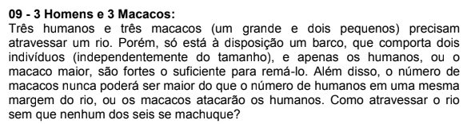

<h1> Resolução do problema de 3 homens e 3 macacos </h1>

Esse repositorio utiliza do repositorio <a href=https://github.com/aimacode/aima-python> aima python</a> para resolver o problema dos 3 humanos e 3 macacos descritos pela imagem a baixo.

Para executar abra o arquivo "main.py" dentro da pasta codigos e execute ele.

Esse repositorio tem por objetivo armazenar a solução utilizada para a entrega do trabalho de Inteligencia computacional I da UERJ-ZO
